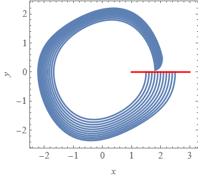

 # EXERCISE:
 **Validate the existence of a stable periodic orbit in the van der Pol equation**
 
  $`x'=y,\quad y'=0.2y(1-x^2)-x`$
  
 ## Methodology:
 - Fix Poincare section $`\Pi = \{(x,0) : x>0\}`$
 

   
 - Take an interval $`X=([x_1,x_2],0) \subset \Pi`$ that apparently contains a fixed point for $`P`$
 - Show that $`P(X)\subset X`$ - this validates the existence of a fixed point
 - Finally show that $`|\frac{\partial P}{\partial x} (X)|<1`$ and thus the orbit is stable

