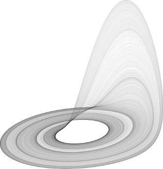
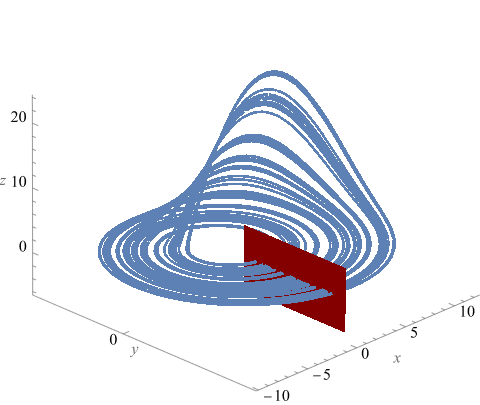
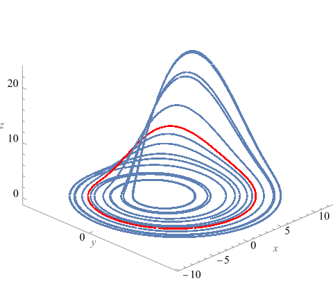

# EXERCISE:
**Validate the existence of a hyperbolic periodic orbit in the Roessler system**

 $`x' = -(y+z),\quad  y' = x+b*y,\quad   z' = b+z*(x-a),\quad  a = 5.7,\quad   b = 0.2`$
 
 

## Methodology:

- Fix Poincare section $`\Pi = \{(0,y,z) : y,z\in\mathbb R\}`$ 

 

 
- Apply the interval Newton method to equation
    
  $`f(y,z) = P(y,z)-(y,z) = 0`$
    
  If succeed, the existence of a periodic orbit is validated. 
  

 
- Check eigenvalues of $`DP`$ using simply Gershgorin estimate to show the orbit is hyperbolic

