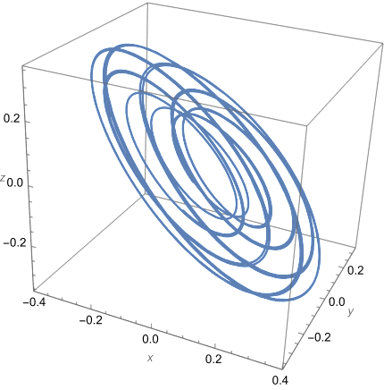

# EXERCISE:
**Check, that a set of trajectories over an explicit time range does not hit an obstacle**

### Problem description:

The Michelson system is given by:

$`x'=y,\quad y'=z,\quad z'= c^2 - y - \frac{1}{2}x^2,\quad   c = 1/8`$

The goal is to show, that all trajectories with the initial conditions satisfying

  $`\begin{array}{rcl}  x(0) &=& 0\\ y(0) &=& -0.125 + e_1\\ z(0) &=& e_2, \end{array}`$
  
where $`e_1,e_2 \in 10^{-4}[-1,1]`$ exists for $`t\in[0,100]`$. Moreover, the following **constraint for the Euclidean norm along the solution is satisfied**

$`\| (x(t),y(t),z(t))\| >= 0.1,\quad t \in [0,100]`$

## Methodology:
- "Record" solutions to IVP as a SolutionCurve object
- Subdivide time range and check the required constraint (avoiding obstacle) for each time-subinterval
