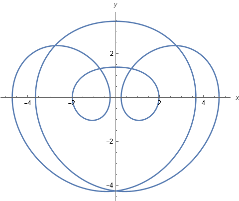

# EXERCISE:
**Check that there is an odd periodic solution to the following piecewise linear system.**

$`x''' + x' + |x|/2 = 1`$

The system can be rewritten as a first order ODE

$`\begin{array}{rcl} x' &=& y\\  y' &=& z\\ z' &=& 1-y-|x|/2\end{array}`$

## Methodology:

- The above system is reversible wrt. $`y`$ axis. 
- Poincare map $`P:\Pi\to \Pi`$, where $`\Pi = {(0,y,z)}`$ is also reversible
- Due to the symmetry it suffices to show that there is $`(0,y_0,0)`$ such that 

  $`P^n(0,y_0,0) = (0,y_1,0)`$ 

  for some $`y_1`$ and $`n>0`$. This implies that the orbit must be closed.
- Use shooting - show that for some $`a,b`$ the Poincare map is defined on the line segment $`[a,b]`$ and

  $`\pi_z P(0,a,0)*\pi_z P(0,b,0)<0`$
