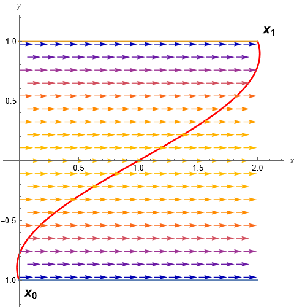

# EXERCISE:
**Find parameter of a system subject to some constraint.**

- Consider the model of a boat sailing across a river of width $`2L: y\in[-L,L]`$.
- We impose that the current of the river is given by $`V(x,y) = (\cos(y\pi/(2L)),0)`$.
- The boat has constant velocity $`v`$ but in the direction specified by the angle $`\alpha`$, that is $`\vec{v}=v(\cos\alpha,\sin\alpha)`$

## Problem: 

Find constant $`\alpha`$ such that the boat starting from $`x(0)=x_0, y(0)=-L`$ reaches the point $`x(T)=x_1`$ and $`y(T)=L`$ for some $`T>0`$.

## Methodology:
- The boat is sailing in y-direction with constant velocity $`v\sin\alpha`$. Thus 

  $`y(t) = -L + tv\sin\alpha`$

  and the travelling time to a point with $`y(t)=L`$ must be 
  
  $`T(\alpha)=2L/(v\sin\alpha)`$
  
- The motion in $`x`$-direction is modeled by a nonatunomous ODE

  $`\begin{array}{rcl}x' &=& \cos(y\pi/(2L)) + v\cos\alpha \\ &=& cos( (tv\sin\alpha-L)\pi/(2L) ) + v\cos\alpha\end{array} `$
  
- We have to solve the equation 

  $`x(2L/(v\sin\alpha)) = x_1`$
 
  for $`\alpha`$.

- Apply interval Newton method to equation:

  $`f(\alpha) = \phi(T(\alpha),x_0) - x_1 = 0`$
  
## Data:
  $`\begin{array}{rcl}L &=& 1\\ v &=& 0.5\\ (x_0,y_0) &=& (0,-L)\\ (x_1,y_1) &=& (2,L)\end{array}`$
