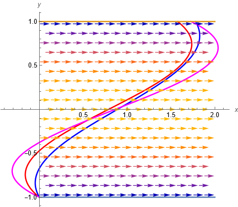

# EXERCISE:
**Find parameter of a system that minimizes a certain property of this system.**

- Please read [Exercise 6](06-finding-system-parameter/README.md) for description of the model of a boat sailing across a river. 

- Here we additionally assume that the current of the river is stronger than the boat engine. Then, the boat must be drifted and there is a minimal value $`x_1`$, such that the boat can reach the point $`(x_1,L)`$.

## Problem: 

Find (local) minimum $`x_1(\alpha)`$ and find control parameter $`\alpha`$ for which this minimum is taken.    

## Methodology:
- The motion in $`x`$-direction is modeled by a nonatunomous ODE

  $`\begin{array}{rcl}x' &=& \cos(y\pi/(2L)) + v\cos\alpha \\ &=& cos( (tv\sin\alpha-L)\pi/(2L) ) + v\cos\alpha\end{array} `$
  
- We would like to find minimum of 
 
    $`g(\alpha) = \phi(T(\alpha),x_0)`$

  or zero of its derivative

    $`g'(\alpha) = f(T(\alpha),x_0)T'(\alpha) + \frac{\partial\phi}{\partial x}(T(\alpha),x_0)`$

- Apply interval Newton method to the equation

  $`g'(\alpha) = 0`$
  
## Data:
  $`\begin{array}{rcl}L &=& 1\\ v &=& 0.5\\ (x_0,y_0) &=& (0,-L)\\ (x_1,y_1) &=& (2,L)\end{array}`$

